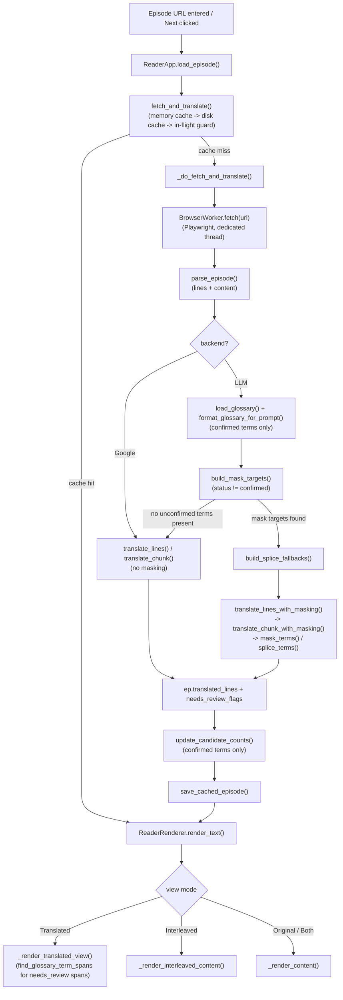
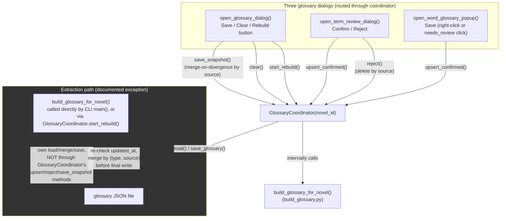

# Glossary Architecture

This document is a current-state architecture reference for the Alphapolis
reader's translation and glossary pipeline. It exists alongside three
narrative design docs in this same directory -- `DESIGN.md` (the glossary
term-consistency and masking/splicing system), `RETRANSLATION_DESIGN.md`
(the line-level retranslation feature), and `REFACTOR_DESIGN.md` (the
`ReaderApp`/`ReaderRenderer` split and the `GlossaryCoordinator` build-out)
-- but it is independent of them: those three are chronological build logs
recording *why* each decision was made, phase by phase, and their own line
numbers drift release to release. This document instead describes *what the
code does right now*, with every file:line reference and every data sample
freshly verified against the current codebase and current on-disk files as
of 2026-07-30. Where this document needs to point at a specific historical
decision or an accepted limitation, it names the doc/section rather than
re-narrating it.

All file references below are relative to `pyplayground/webnovels/` unless
otherwise noted.

## How it all fits together

A reading session starts with an episode URL, either typed on the command
line or clicked via Previous/Next navigation. `ReaderApp.load_episode()`
(`alphapolis_reader.py:1697`) runs the actual work on a background thread so
the Tk UI doesn't freeze, and delegates to `fetch_and_translate()`
(`alphapolis_reader.py:1579`), which checks three layers before doing any
real work: an in-memory dict (`self.cache`), the on-disk episode cache
(`load_cached_episode()`), and an in-flight-request guard that makes a
second caller for the same URL (a common race between prefetching the next
chapter and the user clicking Next before prefetch finishes) wait on the
first caller's result instead of duplicating a real network fetch and a real
LLM translation pass.

If nothing is cached, `_do_fetch_and_translate()` (`alphapolis_reader.py:1618`)
takes over. It asks the singleton `BrowserWorker` thread (a dedicated daemon
thread that owns a headless Playwright/Chromium browser context, since
Playwright's sync API is bound to whichever thread started it) to fetch the
page HTML, then hands that HTML to `parse_episode()`
(`alphapolis_reader.py:421`), which walks the `#novelBody` DOM subtree in
document order and produces both a flat `lines` list (text paragraphs only)
and a mixed `content` list (text and image items interleaved, in the order
they actually appear on the page).

Translation happens next, and which function handles it depends on backend
and glossary state. If the backend is Google Translate (`BACKEND_GOOGLE`),
translation always goes through the plain `translate_lines()` /
`translate_chunk()` path with no masking at all -- Google's endpoint has no
mechanism to honor a glossary or survive a sentinel placeholder, so masking
would only corrupt its output. If the backend is the local LLM
(`BACKEND_LLM`), the current novel's glossary is loaded first and formatted
into prompt text via `format_glossary_for_prompt()`, which injects only
`STATUS_CONFIRMED` terms -- a human has to have vetted a term before it's
allowed to steer live translation output. Separately from that prompt
injection, `build_mask_targets()` scans the chapter's source lines for any
occurrence of a term whose status is *not* confirmed (i.e. still sitting in
the review queue) and returns a list of `(line_idx, word)` pairs to mask. If
that list is empty -- no unconfirmed terms appear in this chapter at all --
translation proceeds through the plain `translate_lines()` path even on the
LLM backend, since there's nothing to mask. If it's non-empty,
`translate_lines_with_masking()` is used instead: it chunks the input the
same way `translate_lines()` does, but for each chunk it replaces every
masked word with an opaque `⟦TERM_n⟧` sentinel before sending the chunk to
the model, so the model translates *around* the term without ever seeing or
attempting to translate it, then splices something back into that sentinel's
position afterward. What gets spliced back is either the term's best
suggested candidate translation (if one exists, via
`build_splice_fallbacks()`/`best_candidate_for_term()`) or, failing that, the
raw untranslated source word -- either way, the line is flagged
`needs_review=True`, because neither path actually produced a real
translation for that term.

The result of this stage becomes `ep["translated_lines"]` (always a plain
list of strings, regardless of which path produced them) and a parallel
`ep["needs_review_flags"]` list of booleans, the same length and order,
recording which lines had a masked term spliced into them. This pair gets
written to the on-disk episode cache (keyed by a SHA-256 hash of the URL) and
kept in memory. Separately, for the LLM backend, `update_candidate_counts()`
walks the same source/translated line pairs looking for *confirmed* terms
whose `confirmed_target` string actually shows up in the translated output,
and increments that candidate's usage count each time it matches -- this is
how a confirmed term's chosen translation earns evidence over time, entirely
independent of the masking/review-queue mechanism, which only concerns itself
with not-yet-confirmed terms.

Rendering is owned by `ReaderRenderer` (`alphapolis_reader.py:638`), a
class `ReaderApp` composes rather than inherits from, holding a
back-reference to the app for state it reads but doesn't own (current URL,
episode, the shared `tk.Text` widget itself). Four view modes exist:
Original, Translated, Both, and Interleaved. In Translated mode, if a cached
episode has `needs_review_flags` data, rendering reconstructs
`TranslatedLine` objects from the flags and re-locates the *exact character
span* of each masked/spliced term within the already-translated line (via
`find_glossary_term_spans()`, which -- unlike `build_mask_targets()` --
searches every glossary term regardless of current status, since a
needs-review flag records a historical fact about that translation attempt
that a term's status changing later shouldn't erase). Only that span gets
the amber/underlined `needs_review` Tk tag; the rest of the line keeps its
normal translated-text styling. Interleaved mode instead prints each source
line immediately followed by its translated line, repeating for every
paragraph, using the same span-tagging helper for needs-review highlighting
on the translated half of each pair.

Three separate dialogs let a person feed corrections back into the
glossary, plus a fourth for correcting ordinary mistranslations that have
nothing to do with proper nouns. Right-clicking selected text opens
`open_word_glossary_popup()`, a lightweight "Add to Glossary" form pre-filled
with a Google guess, an LLM guess, and (for the LLM backend) a live
`explain_term()` classification and etymology; saving here always writes a
`STATUS_CONFIRMED` term immediately. Clicking a needs-review-highlighted span
routes to the same popup, pre-filled with the specific masked term that was
clicked. `open_glossary_dialog()` is the full term editor: every term of
every status, editable in a Treeview, batched and written only on Save (or
discarded on Cancel), plus buttons to clear the whole glossary or trigger a
background rebuild from cached episodes. `open_term_review_dialog()` is a
narrower, faster one-at-a-time screen scoped only to the unconfirmed
backlog, with just Confirm (writes immediately) and Reject (deletes the term
outright, since a rejected term must never linger at a non-confirmed status
-- that would keep it masked forever with no way to un-flag it) actions, no
batch "confirm all" option by design. All three route their actual disk
writes through a shared `GlossaryCoordinator` rather than calling
`load_glossary()`/`save_glossary()` directly, so the "load a stale snapshot,
write it back blindly" bug class that kept recurring across these three
surfaces (and the separate extraction/rebuild path) only has to be fixed
once. Whatever a chapter is confirmed here only takes effect on that
chapter's *next* fetch/refresh -- an already-cached, already-rendered episode
is not retroactively re-translated.

Separately, in Interleaved view specifically, right-clicking the *original*
(source-language) half of a line offers "Retranslate this line...", which
opens `open_retranslate_popup()`. This is a different correction mechanism
entirely -- it exists for ordinary vocabulary/idiom mistranslations, not
proper-noun consistency, and calls a single-line LLM correction function,
`retranslate_line_with_hint()`, that never touches masking or the glossary
module at all (it only accepts pre-formatted glossary text as an optional
string, same architectural boundary as the rest of `llm_translate.py`).
Accepting a candidate here overwrites the line both in the live Tk widget
and in the in-memory `episode["translated_lines"]` list, so the fix survives
a view-mode switch within the same session, but it is never written to the
on-disk cache -- reloading the chapter or restarting the app reverts it.

Finally, a separate, decoupled batch process -- `build_glossary_for_novel()`
in `build_glossary.py`, run manually or via the glossary dialog's "Rebuild
Glossary" button -- scans every cached episode for a novel, sends each one's
source and translated text to the LLM asking it to extract character names
and recurring terms, and merges the results into the glossary as
`STATUS_SUGGESTED` entries, which then populate the review-queue dialogs
described above. This path deliberately does not route through
`GlossaryCoordinator` for its own extraction merge (a bulk, lower-trust
write has a different trust model than a single human-reviewed edit), but it
does do its own re-check-before-write logic to avoid clobbering a concurrent
dialog write, and it skips episodes it has already extracted from via a
persisted `extracted_episode_urls` list on the glossary file, so re-running
a rebuild doesn't repeat an LLM call for every previously-processed episode
every time.

## Fetching and caching

**`BrowserWorker`** (`alphapolis_reader.py:282`) is a dedicated daemon thread
owning one Playwright/Chromium `BrowserContext` for the app's entire
lifetime, communicating with the rest of the app via a request/response
`queue.Queue` pair (`fetch()` at `alphapolis_reader.py:348` puts a URL on the
request queue and blocks on the response queue). This exists because
Playwright's sync API cannot be called from a different thread than the one
that started it. `fetch()` waits on `#novelBody, .p-novel-episode__text`
before returning page HTML, since the site serves an empty bot-check
response otherwise.

**`load_cached_episode()`/`save_cached_episode()`** (`alphapolis_reader.py:152`,
`alphapolis_reader.py:170`) key the on-disk cache by a SHA-256 hash of the
episode URL under `~/.cache/alphapolis_reader/`. **`CACHE_SCHEMA_VERSION`**
(`alphapolis_reader.py:115`, currently `4`) is checked on load
(`alphapolis_reader.py:165`); a mismatch returns `None` (cache miss) rather
than attempting any migration, so the episode gets refetched and
retranslated from scratch. Version 4 added `needs_review_flags` as a
parallel `List[bool]` alongside `translated_lines`.

## Core translation path

**`translate_lines()`** (`llm_translate.py:824`) packs source lines into
chunks under a character budget, maintains a sliding window of previously
translated paragraphs as context, and calls **`translate_chunk()`**
(`llm_translate.py:444`) per chunk. `translate_chunk()` asks the model for a
JSON array of translated strings matching the input array's length and
order exactly (`TRANSLATION_PROMPT`, `llm_translate.py:86`) -- a JSON-array
contract chosen specifically because a plain-text/labeled prompt format was
confirmed, via live testing, to sometimes make the model hallucinate an
entire fabricated scene instead of translating. If the model returns an
array of the wrong length, `translate_chunk()` retries by translating each
line in the chunk individually (`llm_translate.py:492-497`) rather than
discarding the whole chunk; a line that still fails becomes a
`"[translation failed: ...]"` placeholder so callers can always rely on the
output-length invariant. `alphapolis_reader.py:525` has its own
module-level `translate_lines()` that dispatches to either the LLM path
(`llm_translate.translate_lines`) or a separate Google Translate
implementation (`alphapolis_reader.py:507`), selected by the `backend`
parameter.

## Masking and splicing

**`build_mask_targets()`** (`glossary.py:298`) decides which term
occurrences to mask: every literal-substring occurrence of every term whose
`status != STATUS_CONFIRMED`, longer term sources matched before shorter
ones so a term that's a substring of another can't fragment the longer
match. Returns `(line_idx, word)` pairs in line-then-position order.

**`mask_terms()`** (`llm_translate.py:176`) replaces each target word with
an opaque `⟦TERM_n⟧` sentinel (validated 15/15 survival against
translategemma in `test_sentinel_survival.py`; bracket/XML-wrapped
alternatives scored 0/15, since the model reads those as translatable
content rather than structure to preserve). **`splice_terms()`**
(`llm_translate.py:198`) reverses this on the model's output: if the
sentinel survived (even with normalized bracket/digit glyphs), the fallback
text is spliced into its exact position; if the sentinel is missing
entirely, the fallback is appended to the line instead. `splice_terms()`
accepts an optional `fallbacks: Dict[str, str]` (built by
**`build_splice_fallbacks()`**, `glossary.py:406`) mapping each masked word to
its best-ranked suggested candidate (via **`best_candidate_for_term()`**,
`glossary.py:378`, ranked by count then origin tiebreak `user > mt > llm`)
instead of the bare raw word, when one exists. `needs_review` on the
returned `TranslatedLine` is `True` whenever `targets` is non-empty at all,
regardless of which recovery path fired -- masking never asks the model to
translate a masked term, so "spliced" and "actually translated" are never
the same fact.

**`translate_chunk_with_masking()`** (`llm_translate.py:508`) wraps
`translate_chunk()`: masks the chunk's lines, translates, then splices each
line's result. It has an additional whole-line-empty recovery path (distinct
from the missing-sentinel path): if a masked line comes back blank, it
retries that single line once; if still blank, it falls back to the raw,
unmasked source line verbatim (not a per-term fallback substitution) and
flags `needs_review=True`. **`translate_lines_with_masking()`**
(`llm_translate.py:923`) is the chunking sibling of `translate_lines()`:
`mask_targets` is expressed against the whole input, but chunking is
internal to this function, so it re-indexes each `(line_idx, word)` pair to
be relative to whichever chunk it falls into (`llm_translate.py:1007`)
before calling `translate_chunk_with_masking()` per chunk.

## Term data model

Defined in `glossary.py`. A term dict's shape (`glossary.py:64-77`):
`source`, `type` (`TERM_TYPE_CHARACTER` or `TERM_TYPE_GENERAL`), `candidates`
(list of `{target, count, origin}`), `confirmed_target`, `status`
(`STATUS_CONFIRMED` or `STATUS_SUGGESTED`), `note`, and character-only
`gender`/`pronoun_style`/`honorific_override`. **`make_confirmed_term()`**
(`glossary.py:86`) builds an immediately-trusted term (the manual
"Highlight -> Add Term" path); **`make_suggested_term()`** (`glossary.py:113`)
builds an unreviewed one (LLM extraction). **`format_glossary_for_prompt()`**
(`glossary.py:232`) is the only function that reads terms for prompt
injection, and filters to `STATUS_CONFIRMED` only.

**`merge_terms()`** (`glossary.py:629`) dedupes on `(type, source)` --
existing entries always win on conflict, new entries are appended only if
their `(type, source)` key isn't already present. This is the bulk-extraction
merge function (`build_glossary.py`'s only caller), and deliberately allows a
`character` and a `term` entry with the same source text to coexist as two
distinct, independently-reviewable candidates. **`upsert_confirmed_term()`**
(`glossary.py:665`) is a different function for a different caller (the
manual confirm dialogs): it dedupes on `source` alone, and a new entry always
replaces *every* existing entry for that source regardless of type or
status. Its docstring documents the real bug this fixes: a source word
extracted under one type by the bulk path, then confirmed under a different
type via a dialog, used to leave two entries for the same source, one of
which stayed unconfirmed and kept getting masked forever. These two
functions must not be conflated -- they intentionally use different dedup
keys for different trust levels.

## GlossaryCoordinator

`glossary_coordinator.py`'s `GlossaryCoordinator` class (`glossary_coordinator.py:66`)
is constructed per novel (`GlossaryCoordinator(novel_id)`) and owns every
write path so no dialog has to do its own load/write pair. Interface,
confirmed against the current file:

- **`load()`** (`glossary_coordinator.py:84`) -- thin wrapper over `load_glossary()`.
- **`save_snapshot(opened_at, local_terms, edited_sources, deleted_sources, honorific_policy)`**
  (`glossary_coordinator.py:92`) -- the write path for a caller that held a
  long-lived in-memory snapshot over a whole dialog session
  (`open_glossary_dialog()`'s Save). Reloads fresh, compares `updated_at`
  against `opened_at`; if unchanged, writes `local_terms` as-is; if another
  writer touched the file in the meantime, merges by source, letting only
  `edited_sources` overwrite the fresh on-disk copy and popping
  `deleted_sources` last so an explicit delete always survives.
- **`clear()`** (`glossary_coordinator.py:166`) -- unconditional reset to an
  empty glossary, deliberately not routed through `save_snapshot()` since a
  Clear isn't an edited snapshot to reconcile.
- **`upsert_confirmed(new_term)`** (`glossary_coordinator.py:192`) -- reload
  fresh, then `upsert_confirmed_term()`, then save. Used by callers that
  write once per action with no held snapshot: `open_term_review_dialog()`'s
  Confirm and `open_word_glossary_popup()`'s Save.
- **`reject(source)`** (`glossary_coordinator.py:215`) -- reload fresh, then
  delete every entry matching `source` (a real delete, not a status change).
  Matches by source string, not object identity -- the docstring documents
  a real bug found in phase 3c: identity matching (`t is not term`) only
  worked in the original dialog-local code because it mutated the same
  in-memory dict it loaded once; a coordinator that reloads fresh internally
  can never produce an object-identical term to one from an independent
  caller-side `load_glossary()` call.
- **`is_rebuild_running()`** / **`start_rebuild(status_cb, on_complete)`**
  (`glossary_coordinator.py:252`, `glossary_coordinator.py:256`) -- runs
  `build_glossary_for_novel()` on a background thread, tracking
  `_rebuild_in_progress` as shared, cross-dialog-visible state (a no-op if
  already running).
- **`notify_edited(edited)`** (`glossary_coordinator.py:309`) -- confirmed
  still a documented no-op (logs at debug level only); the callback it's
  meant to forward to has not been wired up.

Verified in `alphapolis_reader.py`: `open_glossary_dialog()`'s rebuild button
calls `coordinator.start_rebuild()` (`alphapolis_reader.py:2192`), gated by
`coordinator.is_rebuild_running()` (`alphapolis_reader.py:2161`); its Save
button calls `GlossaryCoordinator(novel_id).save_snapshot(...)`
(`alphapolis_reader.py:2236`); its Clear Glossary button calls
`GlossaryCoordinator(novel_id).clear()` (`alphapolis_reader.py:2212`).
`open_term_review_dialog()`'s Confirm/Reject call `upsert_confirmed()`
(`alphapolis_reader.py:2463`) and `reject()` (`alphapolis_reader.py:2488`).
`open_word_glossary_popup()`'s Save calls `upsert_confirmed()`
(`alphapolis_reader.py:2881`). `build_glossary_for_novel()` is the one
documented exception: it does its own load/merge/save in `build_glossary.py`
rather than going through the coordinator (see Extraction section below).

## The three dialogs

**`open_glossary_dialog()`** (`alphapolis_reader.py:1831`) is the full term
editor -- every term of every status in a `ttk.Treeview`, edited on a local
in-memory copy (`terms`) and written only on Save (via
`save_snapshot()`) or discarded on Cancel. It tracks `edited_sources` and
`deleted_sources` locally across the session (only the dialog's UI knows
what was actually touched) for `save_snapshot()`'s merge logic, and is modal
(`win.grab_set()`, `alphapolis_reader.py:1914`) specifically to close off the
interactive-overlap case of the cross-dialog stale-overwrite bug, on top of
(not instead of) the merge-on-divergence fix itself.

**`open_term_review_dialog()`** (`alphapolis_reader.py:2254`) is scoped only
to terms with `status != STATUS_CONFIRMED` (the same broad filter
`build_mask_targets()` uses, catching pre-Section-9-shape terms with no
status field too -- confirmed against novel 375266002's real glossary file,
which has old-shape unconfirmed entries). Confirm and Reject both write
immediately per action, no batching, and deliberately offer no "confirm all"
bulk action.

**`open_word_glossary_popup()`** (`alphapolis_reader.py:2654`) is reached
either from a right-click "Add to Glossary..." context menu item
(`alphapolis_reader.py:2605`) or from clicking a needs-review-highlighted
span (`_on_needs_review_click()`, `alphapolis_reader.py:1126`, pre-filling
Source with the specific clicked term and leaving Target blank, since the
raw spliced text is not a translation guess). It fetches a Google guess, an
LLM guess, and (LLM backend only) an `explain_term()` classification/
etymology before building the form, caching results per `(word, context)`
session-wide.

## Extraction

**`build_glossary_for_novel()`** (`build_glossary.py:340`) loads every cached
episode belonging to a novel (`_load_cached_episodes_for_novel()`,
`build_glossary.py:160`, sorted by cache-file mtime as a reading-order
proxy), skips any episode whose URL is already in the glossary's
`extracted_episode_urls` list (`build_glossary.py:428`), and for the rest
sends a truncated sample (`MAX_EXTRACTION_LINES = 40`, `build_glossary.py:60`
-- confirmed via live testing that a full-length episode makes the model
fall back to re-translating instead of extracting) to the LLM via
`extract_glossary_terms()` (`build_glossary.py:220`). Extracted terms are
converted to the suggested shape (`_to_suggested_term_dicts()`,
`build_glossary.py:305`) and merged in via `merge_terms()`
(`build_glossary.py:439`). Before writing, it reloads the glossary fresh and
compares `updated_at` against what it loaded at the start
(`build_glossary.py:482`); on divergence it merges by `(type, source)` --
not `source` alone -- letting only this run's own `edited_keys` win, so a
concurrent dialog write to an untouched term survives. `extracted_episode_urls`
is updated additively (unioned, `build_glossary.py:505`) rather than
overwritten.

## Rendering

**`ReaderRenderer`** (`alphapolis_reader.py:638`) owns view-mode rendering,
span tracking, and appearance/theming, composed onto `ReaderApp` as
`self.renderer = ReaderRenderer(self)` with a back-reference `self.app`.
`self.text` (the `tk.Text` widget) stays on `ReaderApp`, exposed to the
renderer only via a `@property` (`alphapolis_reader.py:727`), since many
non-rendering call sites in `ReaderApp` still touch it directly.

`render_text()` (`alphapolis_reader.py:1157`) dispatches per view mode:
Original/Both render `_render_content()`; Translated renders
`_render_translated_view()` (`alphapolis_reader.py:958`), which itself
dispatches to `_render_translated_content_from_translated_lines()`
(`alphapolis_reader.py:1027`, span-level needs-review-aware) when the
cached episode has `needs_review_flags`, or the plain
`_render_translated_content()` (`alphapolis_reader.py:990`) otherwise;
Interleaved renders `_render_interleaved_content()`
(`alphapolis_reader.py:889`), pairing lines via
**`build_interleaved_pairs()`** (`alphapolis_reader.py:601`) and falling
back to the plain translated view on a length mismatch.

The needs-review span mechanism is shared by both the translated-only and
interleaved paths via **`_apply_needs_review_spans()`**
(`alphapolis_reader.py:1089`): it calls `find_glossary_term_spans()`
(`glossary.py:467`) against the already-translated line text to locate the
exact masked-term substring(s), then `tag_add()`s the `needs_review` Tk tag
only over those spans (not the whole line), and records each span in
`_review_terms_by_span` for click resolution. Left-clicking a needs-review
span (`_on_needs_review_click()`, `alphapolis_reader.py:1126`, bound via
`tag_bind` at `alphapolis_reader.py:1392`) opens
`open_word_glossary_popup()` pre-filled with the specific term clicked.

## The retranslation feature

Right-clicking the *original*-tagged half of a line, in Interleaved view
only, offers "Retranslate this line..." (`alphapolis_reader.py:2630`),
resolved via `_translated_span_after()` (`alphapolis_reader.py:1211`), which
depends on `_render_interleaved_content()`'s strict one-`(original,
translated)`-pair-per-line append order in `_rendered_spans` -- not a tag
lookup. This opens `open_retranslate_popup()` (`alphapolis_reader.py:2893`),
which calls **`retranslate_line_with_hint()`** (`llm_translate.py:745`): a
plain-text-in/plain-text-out function (deliberately not JSON, validated
empirically against live model output per the function's own comment) that
sees only the single line and its current translation, with no surrounding
context, and never imports or touches `glossary.py` directly (it accepts an
optional pre-formatted `glossary_text` string, same boundary as every other
function in this module).

Accept writes the correction into both the live Tk widget (and
`self.renderer._rendered_spans`) and into
`self.episode["translated_lines"][line_idx]` directly, via a side table
`self.renderer._translated_line_index_by_span` populated by
`_render_interleaved_content()` (`alphapolis_reader.py:952`) -- this second
write-through is what makes the correction survive a view-mode switch within
the same session, since `render_text()` always rebuilds from `self.episode`
fresh. It is still explicitly session-only: `self.episode` is never written
to the on-disk cache, so a reload or restart reverts it. The "also remember
this for next time" checkbox in the popup (`alphapolis_reader.py:3011`) is
wired to a debug-level log statement only (`alphapolis_reader.py:3027`) --
confirmed still a no-op; no global vocabulary-notes store exists.

## Data structure reference

**Term dict** (from `glossary.py`, real excerpt from
`~/.config/alphapolis_reader/glossaries/375266002.json`, one confirmed and
one suggested entry):

```json
{
  "type": "character",
  "source": "ケイト",
  "candidates": [{"target": "Kate", "count": 1, "origin": "user"}],
  "confirmed_target": "Kate",
  "status": "confirmed",
  "note": null,
  "gender": "female",
  "pronoun_style": null,
  "honorific_override": null
}
```

```json
{
  "type": "character",
  "source": "ルリ",
  "candidates": [{"target": "Ruri", "count": 1, "origin": "llm"}],
  "confirmed_target": null,
  "status": "suggested",
  "note": null,
  "gender": "female",
  "pronoun_style": null,
  "honorific_override": null
}
```

**`TranslatedLine`** (`llm_translate.py:157-173`), the dataclass returned by
the masking path:

```python
@dataclass
class TranslatedLine:
    text: str
    needs_review: bool = False
```

**Glossary file top-level shape** (real, from
`~/.config/alphapolis_reader/glossaries/777777777.json`, which is the one
glossary file among the three on disk that actually has
`extracted_episode_urls` populated -- confirms this field lives on the
*glossary* file, not the episode cache):

```json
{
  "novel_id": "777777777",
  "title": "...",
  "honorific_policy": "...",
  "honorific_policy_user_set": true,
  "context_notes": "...",
  "terms": ["... 12 term dicts ..."],
  "updated_at": "...",
  "extracted_episode_urls": [
    "https://www.example.invalid/novel/777777777/1/episode/1",
    "https://www.example.invalid/novel/777777777/1/episode/2",
    "https://www.example.invalid/novel/777777777/1/episode/3"
  ]
}
```

**Episode cache shape** (real, full file except `content`, from
`~/.cache/alphapolis_reader/b526251ae9c1474d7a1bf73eb9f89d7231618da4649bb3590caaf01449fcf247.json`
-- one of only two cache files on disk with any `true` value in
`needs_review_flags`; this example shows the real masking/splice fallback in
action, where the term 鉄パイプ ("iron pipe") had no confirmed target and
was spliced back raw into the English line):

```json
{
  "title": "Phase 2 Verification Novel",
  "author": "Test Author",
  "episode_title": "Chapter 1",
  "translated_title": "Phase 2 Verification Novel",
  "translated_episode_title": "Chapter 1",
  "lines": ["ケイトが振り返った。", "鉄パイプを持っていた。"],
  "translated_lines": ["Kate turned around.", "He was holding a 鉄パイプ."],
  "needs_review_flags": [false, true],
  "prev_url": null,
  "next_url": "https://www.example.invalid/novel/777777777/1/episode/2",
  "_cache_schema_version": 4,
  "url": "https://www.example.invalid/novel/777777777/1/episode/1",
  "novel_id": "777777777"
}
```

Note `extracted_episode_urls` does **not** appear here -- it is a glossary
file field only, confirmed by comparing these two real files directly.

## Two diagrams

### (a) URL to display pipeline



### (b) Glossary write-coordination flow



## Known limitations and gaps

These are load-bearing, already-documented limitations, not new findings --
each is cited by pointer rather than re-explained:

- **Literal-substring-only term matching.** No `variations` field exists;
  matching throughout `glossary.py` (`build_mask_targets()`,
  `find_glossary_term_spans()`, etc.) is exact-substring on a single
  `source` string. A term confirmed under one spelling (e.g. katakana) will
  not match an alternate spelling (e.g. kanji) for the same entity elsewhere
  in the same novel. See `DESIGN.md`'s 2026-07-29 entry.
- **WM_DELETE_WINDOW crash under Xvfb, root cause unconfirmed.** Sending a
  window-manager close request (specifically via `xdotool windowclose`, in
  automated/verification tooling) to a `Toplevel` dialog was confirmed to
  crash the whole process. This does not mean the app's own
  `win.protocol("WM_DELETE_WINDOW", close_dialog)` bindings are unsafe in
  ordinary use (confirmed present and working normally in
  `open_glossary_dialog()` and `open_term_review_dialog()` --
  `alphapolis_reader.py:1930`, `alphapolis_reader.py:2331`); the crash is
  specifically tied to how that close signal was delivered in test tooling.
  See `DESIGN.md`'s 2026-07-28 entry for the full reproduction.
- **Classification drift.** `explain_term()`'s live, on-demand
  character-vs-term classification and `build_glossary.py`'s bulk extraction
  have no shared source of truth and can disagree on the same word's type.
  See `DESIGN.md` Section 8. Noted as unresolved, low-priority.
- **Retranslation phases 4-5 not started**, confirmed by grep: no
  `line_overrides` field exists anywhere in the codebase (persistence, phase
  4) and the "remember this" checkbox remains wired to a no-op debug log
  line (global vocabulary-notes store, phase 5). See
  `RETRANSLATION_DESIGN.md`.
- **REFACTOR_DESIGN.md's four Phase-3 gaps**: the WM_DELETE_WINDOW crash and
  the variations/multi-spelling limitation above (both cross-referenced from
  `DESIGN.md`); two pre-existing timing-dependent test-suite segfault
  sources unrelated to this refactor (Python 3.14/Tk/threading/GC
  interaction -- not re-verified here, out of scope for an architecture
  doc); and an `xdo_helper.screenshot()` tooling quirk (not code, not
  relevant here). REFACTOR_DESIGN.md's own Phases 4-5 (further core app
  shell work) are confirmed not started -- no code matching that scope
  exists.

## Discrepancies found

One genuine behavioral mismatch was found between what the code currently
does and what its own docstrings claim:

- **`_render_translated_content_from_translated_lines()`'s docstring is
  stale and currently wrong.** Its docstring (`alphapolis_reader.py:1044-1050`)
  states: "Not currently called from render_text() -- there is no
  production code path that produces List[TranslatedLine] yet
  (translate_chunk_with_masking() has no live callers...)". This is no
  longer true. `_render_translated_view()` (`alphapolis_reader.py:958`)
  calls this exact method at `alphapolis_reader.py:986` whenever a cached
  episode has populated `needs_review_flags`, which is the normal case for
  any LLM-backend chapter that had at least one unconfirmed glossary term.
  And `translate_chunk_with_masking()` does have a live caller:
  `_do_fetch_and_translate()` calls `translate_lines_with_masking()`
  (`alphapolis_reader.py:1665`), which calls `translate_chunk_with_masking()`
  per chunk (`llm_translate.py:1010`). Both the rendering method and the
  masking translation function are on the live, production call path today
  -- this docstring was evidently written when the rendering-side wiring
  was still pending and was never updated once it landed.

No other discrepancies were found after checking each specific claim listed
in the investigation brief: the `GlossaryCoordinator` interface matches its
documented shape exactly; all three dialogs route through it as described;
`build_glossary_for_novel()`'s documented exception and its `(type, source)`
re-check-before-write merge key are both present and correct in the current
code; `extracted_episode_urls` is additive and lives on the glossary file,
confirmed against real files on disk; `notify_edited()` is confirmed still
an unwired no-op; and no `line_overrides` field exists anywhere, confirming
retranslation phase 4 is still not started.
